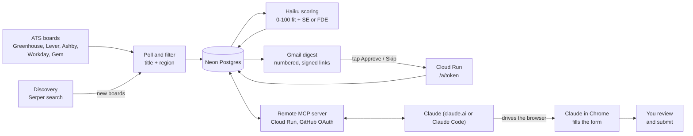

# jobhunt

A job-discovery pipeline for Solutions Engineer and Forward Deployed Engineer roles. It finds
company job boards on Greenhouse, Lever, Ashby, Workday and Gem, pulls every posting, keeps
the ones whose title and location fit (`config/roles.yaml`), scores each new one against two
resume versions with Claude Haiku, and emails a numbered digest every morning. Each entry has
one-tap Approve and Skip links, and an [MCP](https://modelcontextprotocol.io) server lets Claude
turn an approved job into a filled-in application form that a human reviews and submits.

Python 3.12, httpx, Postgres (SQLite locally), FastMCP from the official MCP SDK, GitHub Actions
for the daily run, Cloud Run for the remote server.



The polling, scoring and email run as one `jobhunt daily` job on GitHub Actions. The remote
server is a separate deployment that shares the same database.

```bash
pip install -e ".[dev]"
jobhunt run --no-discover      # poll the seed boards and print new relevant jobs
pytest -q
```

## How a job flows

1. **`new`**: the morning run finds a relevant posting, scores it and puts it in the digest as
   item 3, say. A posting that disappears from its board while still `new` becomes `closed`.
2. **`approved` or `skipped`**: tap Approve or Skip in the email, or tell Claude "approve 3
   and 7". The email link opens a confirmation page and only its button changes the status,
   and only from `new`; a status you set another way is never overwritten.
3. **Prep**: "prep 3" builds the application packet (job, description, the resume variant the
   scorer picked, ticked verified facts, rules). Claude drafts answers from it and fills in
   the form with Claude in Chrome. It never clicks submit.
4. **`applied`**: you review and submit the form, then Claude marks the job `applied`.
5. **`interviewing`, `offer`, `rejected`**: set from chat as things happen. `list_pipeline`
   shows everything approved or later, including jobs that have closed on the board.

## Scorer evaluation

The scorer is checked against a human reading of the same postings: 50 jobs sampled from real
scored ones with a fixed seed (about a third each from scores >= 70, 45-69 and < 45, mixing SE
and FDE), labeled by hand as `strong`, `maybe` or `no` with the resume variant I would send.
The labels are public and never include the model's score or reasons, so they aren't anchored
to it. Scores map to verdicts with fixed buckets (strong >= 70, maybe 45-69, no < 45), and each
model is scored on:

- **Verdict agreement** between the bucketed score and the label, with a confusion matrix.
- **Spearman rho** between the raw score and the label order, which ignores where the bucket
  edges fall.
- **Variant accuracy**: how often the model picks the same resume variant.
- **Cost per job** (from list prices, dated in `src/jobhunt/evals.py`) and p50/p95 latency.

Claude Haiku 4.5 is compared with Claude Sonnet 5.5, both with thinking off so the comparison
is like for like. The tooling and how to reproduce it are in [evals/README.md](evals/README.md);
it needs the private resumes and an API key, so it runs locally and never in CI.

<!-- EVAL RESULTS: filled in after evals/results/*.md are committed -->

The daily run uses `claude-haiku-4-5` (the default in `src/jobhunt/scoring.py`; set
`JOBHUNT_SCORER_MODEL` to change it). It scores up to 300 jobs a run, one at a time, so cost
and latency matter, and the table above is what shows whether a larger model earns its price.

## Engineering choices

- **Polite HTTP.** Every ATS request goes through one client: a descriptive User-Agent, one
  request at a time per host with about a second between requests, and retries with backoff
  on 429, 5xx and transient network errors. Different hosts are polled in parallel.
- **Idempotent digests.** Jobs are numbered and recorded only after the email is sent, so a
  failed send leaves them for the next digest, a job is never emailed twice, and a quiet day
  still sends a short email so silence means something broke.
- **A deterministic packet with ticked facts only.** `build_packet` makes no LLM call. It
  loads only `[x]` items from a gitignored facts file, and its rules tell the model to answer
  "not in verified facts" rather than invent a number, employer or claim.
- **Scanner-safe signed links.** Approve and Skip links are HMAC-SHA256 tokens that expire
  (14 days by default). GET only shows a confirmation page, so a mail scanner or link
  previewer that fetches the URL can't approve anything; the POST does.
- **OAuth allowlisted to one GitHub id.** The remote server is its own MCP authorization
  server and uses GitHub only to log in. It admits one numeric GitHub id, not a login, since
  logins can be renamed and re-registered. Codes and tokens are stored as hashes.
- **Tests never hit the network.** Adapters are tested against recorded fixtures, the API and
  SMTP clients are swapped for fakes, and CI runs the store tests against a real Postgres.
- **Private text stays private.** Resumes and verified facts come from gitignored files or
  secrets, are never logged, and never appear in eval output.

## Setup

- **Local (SQLite):** `pip install -e ".[dev]"`, then `jobhunt run --no-discover`. The database
  is `$DATABASE_URL` if set, else `jobhunt.db`.
- **Cloud digest:** the next section. GitHub Actions, Neon Postgres and Gmail SMTP.
- **Remote MCP server:** built for Cloud Run behind GitHub OAuth, so it can be added to
  claude.ai as a custom connector. The one-time setup is in [docs/deploy.md](docs/deploy.md).
  The server needs the same `DATABASE_URL`, the resumes, the facts and the shared link secret;
  `.env.example` lists the variables.
- **Claude Code (stdio):** the [MCP server section](#claude-code-mcp-server) below.

## Daily digest

`jobhunt daily` is the whole morning run:

1. **Poll.** Register the seed boards (`config/seeds.yaml`), discover more through search
   when `SEARCH_API_KEY` is set, then fetch every known board and keep the relevant jobs.
   Descriptions are stored with them: free for Greenhouse, Lever and Ashby (they come with
   the listing), and fetched only for new relevant jobs on Workday and Gem.
2. **Score.** Up to `--max-score` (default 300) unscored jobs go to Claude Haiku, which
   returns a 0–100 fit, the resume version to send (SE or FDE) and a one-line reason.
   Jobs over the cap, or whose scoring failed, wait for the next run.
3. **Email.** Every scored job not yet in a digest is ranked and numbered, and sent over
   Gmail SMTP. A day with nothing new still sends a short "no new jobs" email, so silence
   always means something broke. The footer reports boards polled, failed boards and
   scoring failures.
4. **Record.** Only after the email is sent are the numbers saved, so a failed send leaves
   those jobs for the next digest and "approve 3 and 7" always refers to what you received.

It exits non-zero if every board failed, the email failed, or scoring failed for every job,
which turns the GitHub Actions run red. A partial failure only shows in the digest footer.

### Running it on GitHub Actions

`.github/workflows/daily.yml` runs `jobhunt daily` at 13:30 UTC (06:30 PDT / 05:30 PST),
never two at once, with a 60-minute limit. Set these repository secrets:

```bash
gh secret set DATABASE_URL          # Postgres URL (e.g. Neon); required
gh secret set ANTHROPIC_API_KEY
gh secret set RESUME_SE < private/resumes/se.md
gh secret set RESUME_FDE < private/resumes/fde.md
gh secret set GMAIL_ADDRESS         # the sending Gmail account
gh secret set GMAIL_APP_PASSWORD    # an app password; needs 2-step verification
gh secret set SEARCH_API_KEY        # optional: Serper key for discovery
gh secret set DIGEST_TO             # optional: recipient, defaults to GMAIL_ADDRESS
```

For the Approve/Skip links, also set the secret `JOBHUNT_LINK_SECRET` and the repository
variable `JOBHUNT_PUBLIC_URL` (the remote server's address). With either unset the digest goes
out without links. [docs/deploy.md](docs/deploy.md) covers both.

Then run it once by hand and check the email arrives before relying on the schedule:

```bash
gh workflow run daily.yml
gh run watch
```

GitHub pauses scheduled workflows in a public repository after 60 days with no repository
activity. If the digest stops arriving, re-enable the workflow in the Actions tab (or push
any commit).

### Dry run locally

```bash
cp .env.example .env               # fill in ANTHROPIC_API_KEY at least
set -a; source .env; set +a
jobhunt daily --dry-run --no-discover
```

The text digest is printed instead of emailed, and no digest is recorded, so the next real
run sends the same jobs. Scoring still calls the API and the scores are saved, so they are
not paid for twice. The database is `$DATABASE_URL` if set, else `jobhunt.db`; pass
`--db other.db` to keep a dry run away from your real data. Resumes come from `RESUME_SE` /
`RESUME_FDE`, else `private/resumes/se.md` and `fde.md` (gitignored).

## Claude Code MCP server

`jobhunt-mcp` is a local [MCP](https://modelcontextprotocol.io) server (stdio) that puts the
job store, the pipeline and the application packet in front of Claude Code, so the morning
digest turns into a conversation: "approve 3 and 7", "prep 3".

```bash
pip install -e ".[dev]"             # installs the jobhunt-mcp script
export DATABASE_URL=postgresql://…  # the database the daily run writes to
claude mcp add jobhunt -- jobhunt-mcp --root /path/to/jobhunt
```

The server runs with the environment `claude` was started in, so start it from a shell with
`DATABASE_URL` set (plus `RESUME_SE` / `RESUME_FDE` if the resumes aren't in
`private/resumes/`, and `SEARCH_API_KEY` for discovery), or pass them to `claude mcp add`
with `-e NAME=value`. If the venv isn't on your `PATH`, use the full path to
`.venv/bin/jobhunt-mcp`. To share the setup per project instead, copy `.mcp.json.example` to
`.mcp.json`: it reads the same variables from the environment and holds no secrets.

The server refuses to start without `--db` or `DATABASE_URL`, because the CLI's `jobhunt.db`
fallback would quietly show an empty database. `config/roles.yaml` and `private/` are read
from `--root`, and so is a relative SQLite `--db` path. Only the protocol goes to stdout;
logs go to stderr.

A job is named by a **ref**: `3` is item 3 of the latest digest, `12#3` is item 3 of digest
12, and a uid such as `greenhouse:acme:123` always works.

| Tool | What it does |
| --- | --- |
| `search_jobs(query?, status?, min_score?, variant?, remote?, limit=20)` | Stored jobs, best score first |
| `get_job(ref)` | Score, reason, status, pay, URL and a description preview |
| `list_pipeline(statuses?)` | Approved, applied, interviewing and offer jobs, closed ones included |
| `update_status(refs, status)` | Batch status change; `new` and `closed` are left to the pipeline |
| `build_packet(ref)` | The application packet: rules, ticked verified facts, resume, description |
| `discover_companies(max_queries=5)` | Search for new boards and register them; the next run polls them |
| `refresh_boards(board_keys, max_boards=5)` | Poll up to 10 boards now; new jobs are scored by the daily run |

Resources: `jobhunt://config/roles`, `jobhunt://facts/verified` (ticked facts only) and
`jobhunt://boards`. Prompts:

- **`morning_triage`** lists the latest digest and the pipeline, asks which numbers to
  approve or skip, and applies the answer with `update_status`.
- **`prep_application(ref)`** builds the packet, drafts answers from its facts only, and has
  Claude in Chrome fill in the form. It never clicks submit: you review and submit, then it
  marks the job applied.

Applications may only use facts ticked (`[x]`) in gitignored `private/verified.md` (format
in `facts/verified.example.md`). Without that file, `build_packet` says so instead of
building a packet.
